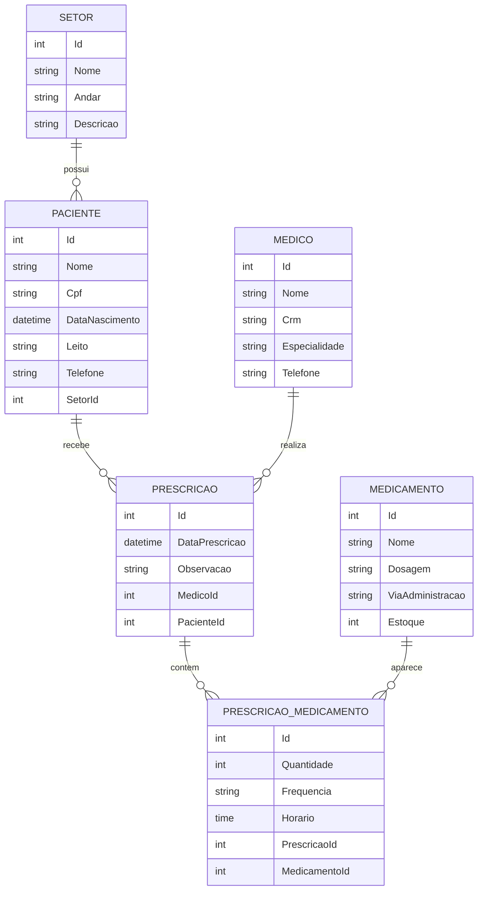

# Diagrama ER em Mermaid

```mermaid
erDiagram
    SETOR ||--o{ PACIENTE : possui
    PACIENTE ||--o{ PRESCRICAO : recebe
    MEDICO ||--o{ PRESCRICAO : realiza
    PRESCRICAO ||--o{ PRESCRICAO_MEDICAMENTO : contem
    MEDICAMENTO ||--o{ PRESCRICAO_MEDICAMENTO : aparece

    SETOR {
        int Id
        string Nome
        string Andar
        string Descricao
    }

    PACIENTE {
        int Id
        string Nome
        string Cpf
        datetime DataNascimento
        string Leito
        string Telefone
        int SetorId
    }

    MEDICO {
        int Id
        string Nome
        string Crm
        string Especialidade
        string Telefone
    }

    MEDICAMENTO {
        int Id
        string Nome
        string Dosagem
        string ViaAdministracao
        int Estoque
    }

    PRESCRICAO {
        int Id
        datetime DataPrescricao
        string Observacao
        int MedicoId
        int PacienteId
    }

    PRESCRICAO_MEDICAMENTO {
        int Id
        int Quantidade
        string Frequencia
        time Horario
        int PrescricaoId
        int MedicamentoId
    }
```
